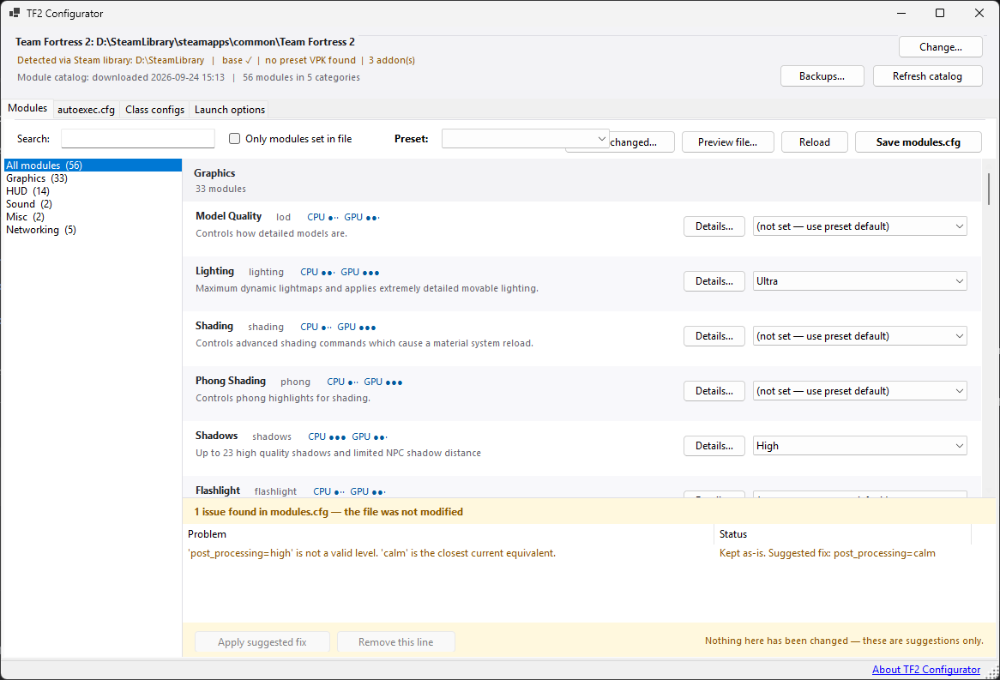
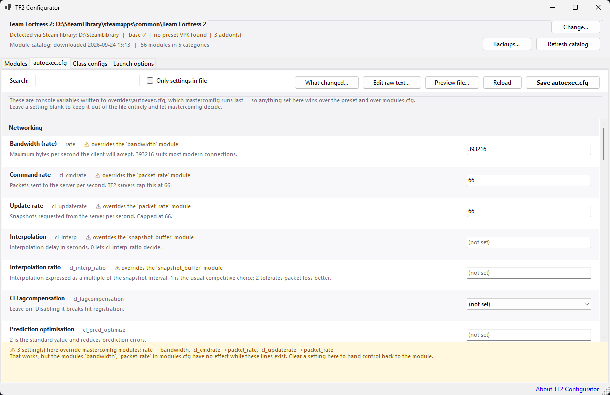
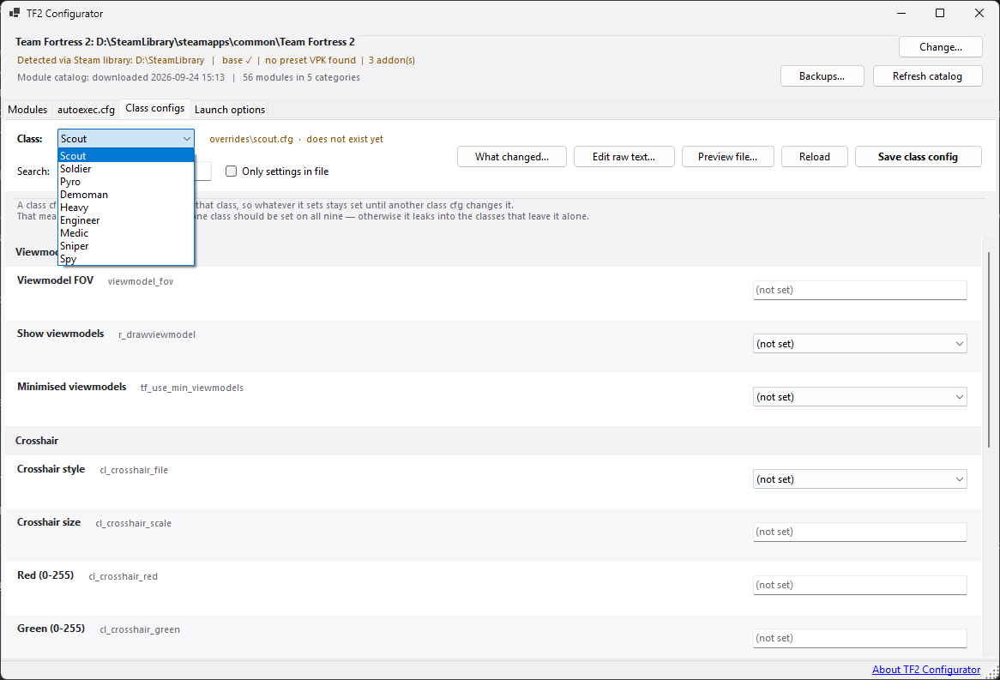
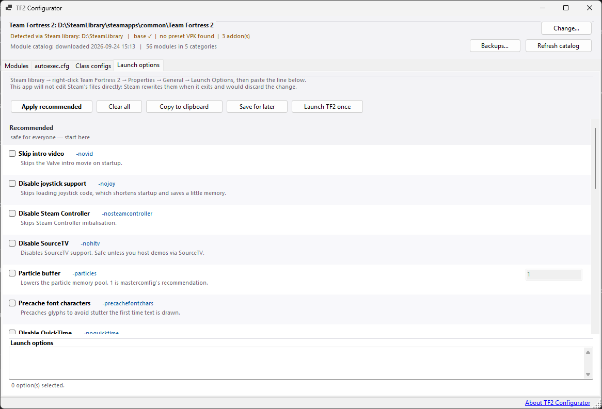

# TF2 Configurator

Windows-приложение для настройки [mastercomfig](https://mastercomfig.com/) в Team Fortress 2.
Вместо того чтобы вручную писать консольные команды, вы выбираете опции в интерфейсе.
Приложение редактирует файлы, которые mastercomfig реально читает — `tf\cfg\overrides\modules.cfg`,
`autoexec.cfg` и конфиги классов — и умеет собирать параметры запуска, не трогая файлы Steam.

Читать на: [English](README.md) · [Русский](README.ru.md)

## Скриншоты

Модули — все модули mastercomfig с уровнями, нагрузкой и описаниями:



Редакторы autoexec.cfg и конфигов классов:




Сборка параметров запуска:



## Что умеет

- **Modules** — все модули mastercomfig из встроенного каталога (сейчас 56), с уровнями,
  нагрузкой на CPU/GPU, заметками и подсказками. Боковая панель категорий, поиск и панель
  проблем, которая сверяет существующий `modules.cfg` с текущим каталогом и *предлагает*
  исправления (неизвестные модули, переименованные уровни, дубликаты ключей). Сама она
  ничего не меняет.
- **Presets** — применение пресетов mastercomfig (destitute → ultra, плюс custom) в один
  клик, как на comfig.app. Меняются только выпадающие списки; сохранение остаётся
  отдельным шагом, который можно проверить.
- **Module details** — кнопка «Details…» у модуля показывает консольные переменные, которые
  задаёт каждый уровень, — прямо из данных mastercomfig.
- **autoexec.cfg** — подобранный список cvar'ов, которые люди реально настраивают (сеть,
  FPS, вид от первого лица, мышь, прицел, HUD, геймплей), с предупреждением, если cvar
  перекрывает модуль mastercomfig. Есть и редактирование файла в виде текста — для биндов,
  алиасов и всего остального.
- **Class configs** — тот же редактор для всех девяти файлов классов, с переключением
  классов, которое никогда не выбрасывает несохранённые правки молча.
- **Launch options** — сборка строки параметров запуска: чекбоксы и текст двусторонне
  синхронизированы, есть безопасный набор «рекомендованных» и предупреждения о рискованных
  флагах. Приложение никогда не пишет в Steam'овский `localconfig.vdf`: строку вставляете
  в Steam сами, либо кнопкой **Launch TF2 once** применяете её к одному запуску через
  `steam://run/440`.

### Безопасность

- **Round-trip fidelity** — файлы никогда не пересоздаются заново. Переводы строк, перенос
  в конце файла, комментарии, пустые строки и неизвестные ключи переживают сохранение
  нетронутыми, если вы их сами не меняли. Неизвестные уровни в файле сохраняются и
  помечаются, а не молча выбрасываются.
- **Бэкапы** — перед каждым сохранением предыдущая версия копируется в
  `%AppData%\TF2Configurator\backups` (хранится 30 дней, максимум 60 папок). Кнопка
  **Backups…** позволяет просматривать бэкапы и восстанавливать любой из них; само
  восстановление сначала делает копию текущего файла, так что его можно откатить.
- **Работа без сети** — каталог и данные пресетов встроены в приложение и могут
  обновляться из репозитория mastercomfig. Скачанное сначала проверяется разбором и только
  потом кэшируется, так что битая загрузка не сломает запуск; тихая проверка обновлений
  происходит раз в несколько дней.
- **Аварии** — необработанные исключения показывают диалог и записываются в
  `%AppData%\TF2Configurator\crash.log`; ошибка никогда не трогает ваши конфиги.

## Требования

- Windows 10/11
- [.NET 10 SDK](https://dotnet.microsoft.com/download/dotnet/10.0) для сборки
- Team Fortress 2 с установленным [mastercomfig](https://mastercomfig.com/download)
  (приложение находит установку через реестр Steam, файлы библиотек или по указанной вами папке)

## Сборка и запуск

```powershell
dotnet build TF2Configurator.slnx
dotnet run --project src\TF2Configurator
```

Тесты и проверка на машине:

```powershell
dotnet test tests\TF2Configurator.Tests
dotnet run --project tools\SmokeTest          # необязательно: можно передать путь к TF2
```

SmokeTest гоняет настоящие парсеры и валидатор на реальной установке и проверяет гарантии
round-trip. Он ничего не пишет в папку игры.

## Обновление встроенных данных

Приложение обновляет свой кэш каталога на лету, но *встроенные* копии — это то, что уходит
в релиз. Когда mastercomfig меняет свои данные, обновите их так:

```powershell
powershell -ExecutionPolicy Bypass -File tools\update-catalog.ps1
```

Скрипт скачивает `modules.json`, `preset_modules.json` и `module_values.json` из
develop-ветки mastercomfig, проверяет каждый файл как JSON и записывает их в `data\` и
`src\TF2Configurator\Assets\`. После этого — пересборка.

## Структура

| Путь | Назначение |
|---|---|
| `src/TF2Configurator/` | Приложение (WinForms, net10.0-windows) |
| — `Models/` | Парсеры каталога и пресетов, редакторы cfg-файлов с сохранением строк |
| — `Services/` | Поиск TF2, сервис каталога, безопасная запись + валидатор, каталоги cvar'ов и параметров запуска |
| — `Forms/` | Главное окно, четыре страницы, просмотр бэкапов, диалоги текста и диффа |
| — `Assets/` | Встроенные копии данных mastercomfig + иконка |
| `tools/SmokeTest/` | Интеграционная проверка (только чтение) на реальной установке TF2 |
| `tools/update-catalog.ps1` | Обновление встроенных данных из upstream |
| `tests/TF2Configurator.Tests/` | xunit-тесты парсинга, редактирования и валидации |
| `data/` | Рабочие копии JSON-файлов mastercomfig |

## Заметки по устройству

- У файла свои условности, и это его дело: LF-файлы остаются LF, отсутствующий перенос
  в конце не выдумывается, а дубликаты ключей читаются и правятся по *последнему* значению
  (тому, которое реально использует движок).
- Панель проблем и кнопки-предложения никогда не меняют файл; любое предложение всё равно
  проходит через обычное сохранение (с бэкапом и просмотром диффа).
- Параметры запуска не пишутся в Steam, потому что Steam перезаписывает `localconfig.vdf`
  при выходе и обычно выбрасывает такую правку — поэтому приложение предлагает копирование
  строки и однократный запуск через `steam://run/440//`.

## ИИ-помощь

Проект разрабатывался с помощью ИИ-ассистента. Он помогал писать и проверять код, тесты
и части этой документации. Всё было просмотрено и поправлено человеком до коммита:

- каждое изменение вручную проверялось перед коммитом
- гарантии round-trip закреплены тестами в `tests/TF2Configurator.Tests`
- ничего здесь не публикуется как непроверенный вывод ИИ — за конечное состояние кода
  отвечает всё равно человек